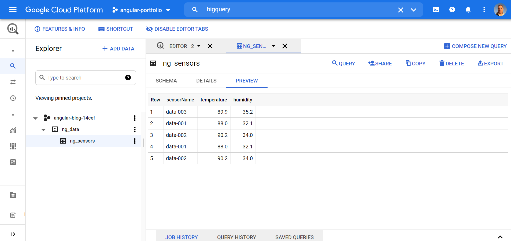

# :zap: Python BigQuery Data

* Python code to write data to a table in Google Cloud Bigquery
* Code from [D-I-Ry](https://www.youtube.com/channel/UCMHvK9tare9Y9O152C9wm3Q/featured) - see [:clap: Inspiration](#clap-inspiration) below
* **Note:** to open web links in a new window use: _ctrl+click on link_


* [:zap: Python BigQuery Data](#zap-python-bigquery-data)
  * [:books: General info](#books-general-info)
  * [:camera: Screenshots](#camera-screenshots)
  * [:signal_strength: Technologies](#signal_strength-technologies)
  * [:floppy_disk: Setup](#floppy_disk-setup)
  * [:computer: Code Examples](#computer-code-examples)
  * [:cool: Features](#cool-features)
  * [:clipboard: Status & To-do list](#clipboard-status--to-do-list)
  * [:clap: Inspiration](#clap-inspiration)
  * [:file_folder: License](#file_folder-license)
  * [:envelope: Contact](#envelope-contact)

## :books: General info

* Python connects to Google Cloud Bigquery table using a JSON access key file in an `/access` directory (ignored by Git)
* Requires Pip module: google-cloud-bigquery
* Note schema has to be set up in the Bigquery table or transfer of data will not work
* a repeated transfer of the same rows will just add duplicated rows to the cloud-based table - see image

## :camera: Screenshots



## :signal_strength: Technologies

* [Python v3](https://www.python.org/) programming language
* [pip google-cloud-bigquery v0.34.0](https://pypi.org/project/google-cloud-bigquery/) Google BigQuery API client library

## :floppy_disk: Setup

* [Install Python](https://docs.python-guide.org/starting/installation/)
* [Install pip](https://docs.python-guide.org/dev/virtualenvs/#installing-pipenv)
* Install pip module using `pip3 install --upgrade google-cloud-bigquery`
* Add code
* Run `python writer.py` to run app

## :computer: Code Examples

* `write.py` code to insert rows in clou-based Bigquery table

```python
client = bigquery.Client()
table_id = 'angular-blog-14cef.ng_data.ng_sensors'

rows_to_insert = [
  {u'sensorName':'data-001', u'temperature': 88.0, u'humidity': 32.1},
  {u'sensorName':'data-002', u'temperature': 90.2, u'humidity': 34.0},
  {u'sensorName':'data-003', u'temperature': 89.9, u'humidity': 35.2},
]
```

## :cool: Features

* not much code required to pass data to a table in the cloud.
* Google Cloud Bigquery has lots of sample code, e.g. [Insert rows with no IDs](https://cloud.google.com/bigquery/docs/samples/bigquery-table-insert-rows-explicit-none-insert-ids)

## :clipboard: Status & To-do list

* Status: Working
* To-do: Add data etc.

## :clap: Inspiration

* [D-I-Ry: Write to BigQuery using Python](https://www.youtube.com/watch?v=fmGhBvA5tSo)
* [Google Cloud Docs: BigQuery code samples](https://cloud.google.com/bigquery/docs/samples)

## :file_folder: License

* This project is licensed under the terms of the MIT license.

## :envelope: Contact

* Repo created by [ABateman](https://github.com/AndrewJBateman), email: gomezbateman@yahoo.com
